# #boraCodar

    Weekly challenges proposed by Rocketseat.  

   <table>
    <thead>
        <tr>
            <th align="center">
                 
                

                    <small>#</small>
                

            </th>
            <th align="center">
                 
                
 
                    <small>
                        NAME
                    </small>
                

            </th>
            <th align="center">
                
                
 
                    <small>
                    PREVIEW
                    </small>
                

            </th>
        </tr>
    </thead>
    <tbody>
        <tr>
          <td>01</td>
          <td>
            <a href="music-player">Music Player </a>
          </td>
          <td align="center">
           <a href="https://lucazcruz.github.io/bora-codar/music-player/">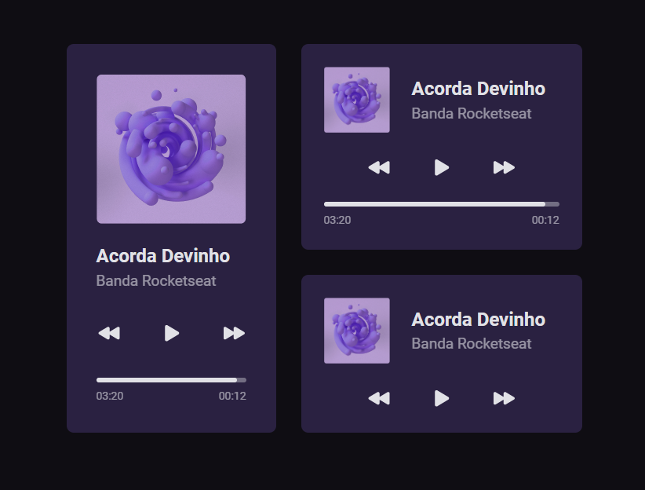</a>
          </td>
        </tr>
        <tr>
          <td>02</td>
          <td>
            <a href="product-card">Product Card</a>
          </td>
          <td align="center">
           <a href="https://lucazcruz.github.io/bora-codar/product-card/">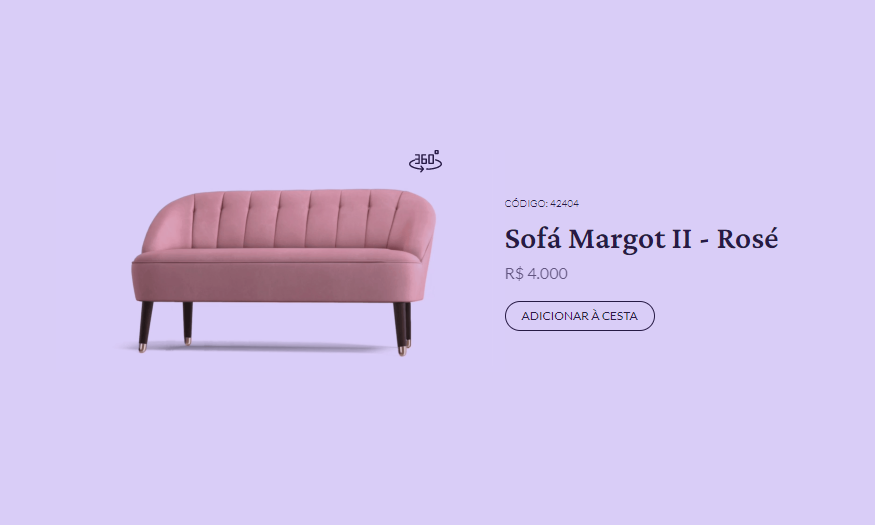</a>
          </td>
        </tr>
        <tr>
          <td>03</td>
          <td>
            <a href="botoes-e-cursores">Botões e Cursores</a>
          </td>
          <td align="center">
           <a href="https://lucazcruz.github.io/bora-codar/botoes-e-cursores/">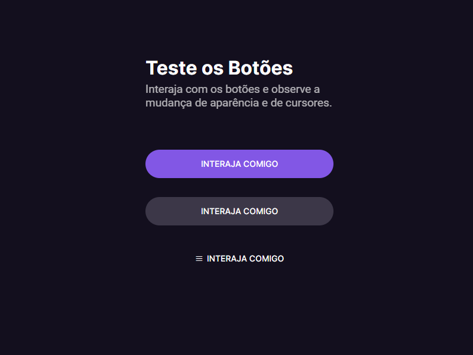</a>
          </td>
        </tr>
        <tr>
          <td>04</td>
          <td>
            <a href="chat">Chat</a>
          </td>
          <td align="center">
           <a href="https://lucazcruz.github.io/bora-codar/chat/">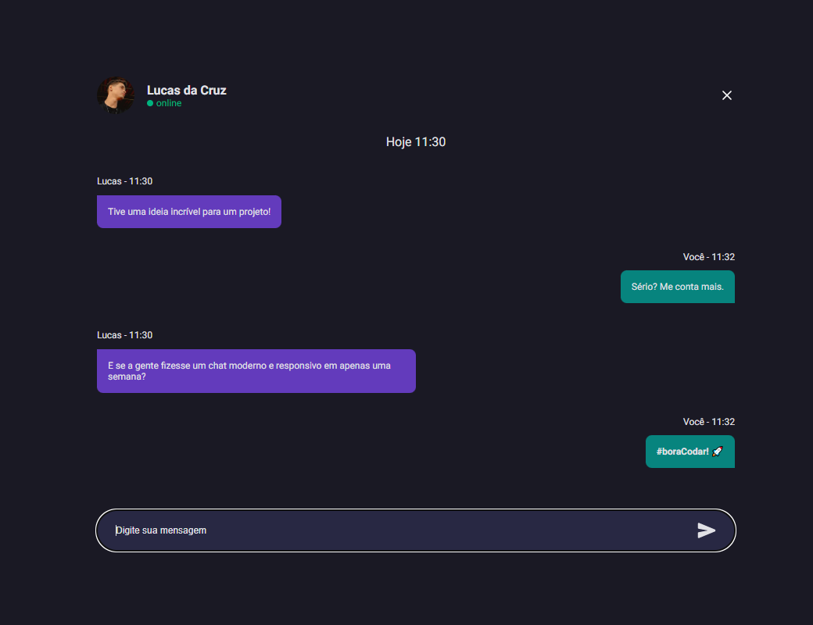</a>
          </td>
        </tr>
        <tr>
          <td>05</td>
          <td>
            <a href="calculator">Calculator</a>
          </td>
          <td align="center">
           <a href="https://lucazcruz.github.io/bora-codar/calculator/">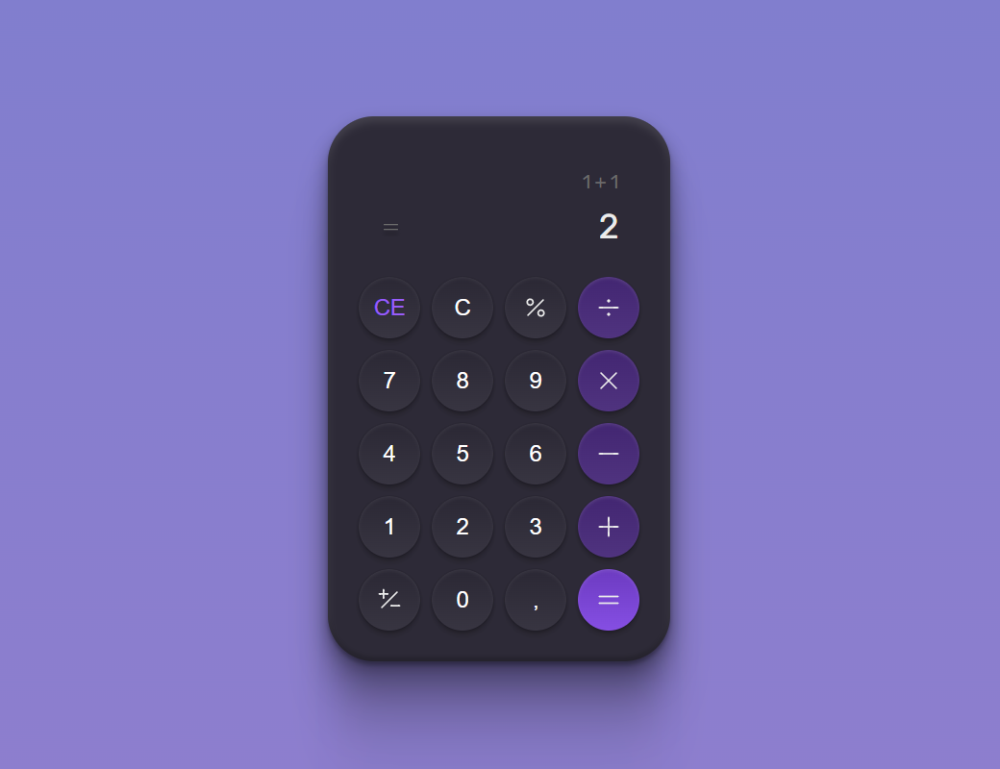</a>
          </td>
        </tr>
        <tr>
          <td>06</td>
          <td>
            <a href="boarding-pass">Boarding Pass</a>
          </td>
          <td align="center">
           <a href="https://lucazcruz.github.io/bora-codar/boarding-pass/">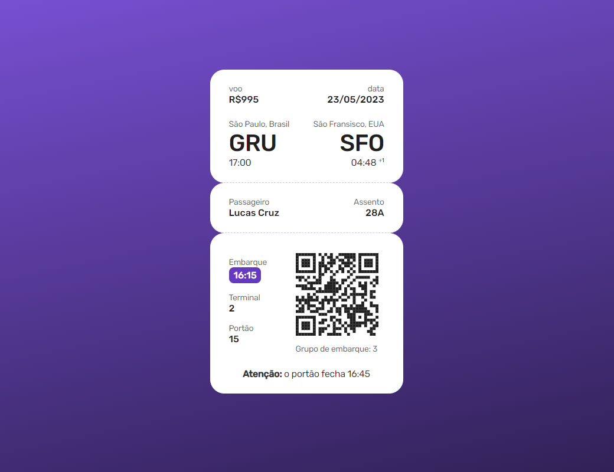</a>
          </td>
        </tr>
        <tr>
          <td>07</td>
          <td>
            <a href="blocos-do-carnaval">Blocos do Carnaval</a>
          </td>
          <td align="center">
           
          </td>
        </tr>
        <tr>
          <td>08</td>
          <td>
            <a href="Dashboard">Dashboard</a>
          </td>
          <td align="center">
           <a href="https://lucazcruz.github.io/bora-codar/dashboard/">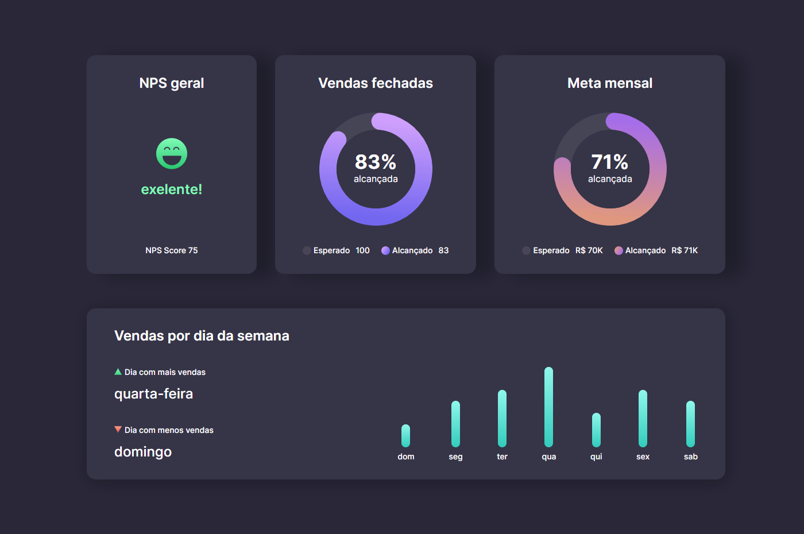</a>
          </td>
        </tr>
        <tr>
          <td>09</td>
          <td>
            <a href="conversor-de-moedas">Conversor de Moedas</a>
          </td>
          <td align="center">
           <a href="https://lucazcruz.github.io/bora-codar/conversor-de-moedas/">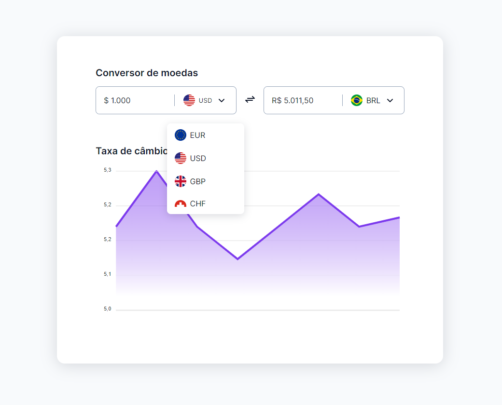</a>
          </td>
        </tr>
        <tr>
          <td>10</td>
          <td>
            <a href="pagina-de-clima">Página de Clima</a>
          </td>
          <td align="center">
           <a href="https://lucazcruz.github.io/bora-codar/pagina-de-clima/">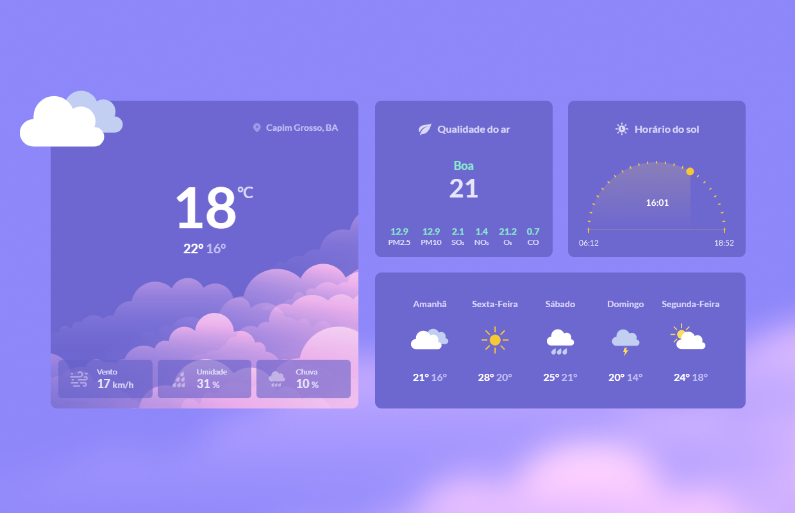</a>
          </td>
        </tr>
        <tr>
          <td>11</td>
          <td>
            <a href="pagina-de-login">Página de Login</a>
          </td>
          <td align="center">
           
          </td>
        </tr>
        <tr>
          <td>12</td>
          <td>
            <a href="kanban">Kanban</a>
          </td>
          <td align="center">
           <a href="https://lucazcruz.github.io/bora-codar/kanban/">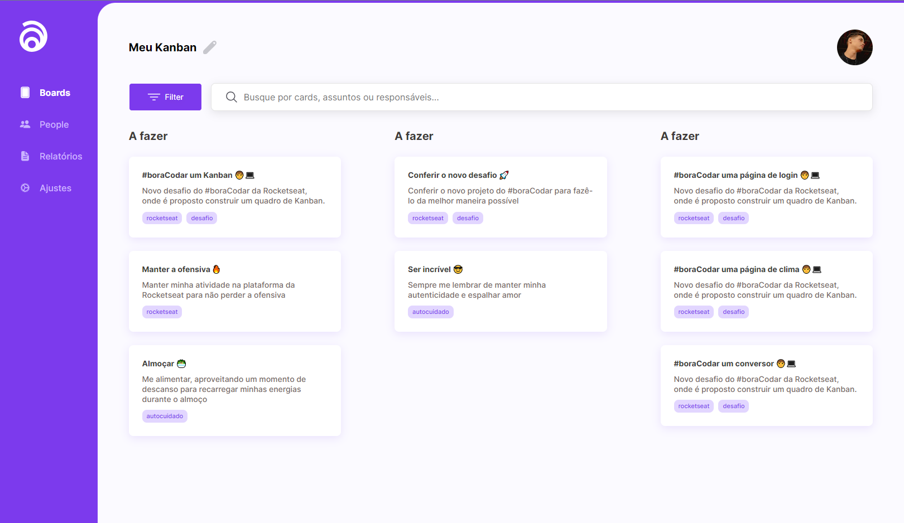</a>
          </td>
        </tr>
        <tr>
          <td>13</td>
          <td>
            <a href="credit-card-form">Credit Card Form</a>
          </td>
          <td align="center">
           <a href="https://lucazcruz.github.io/bora-codar/credit-card-form/">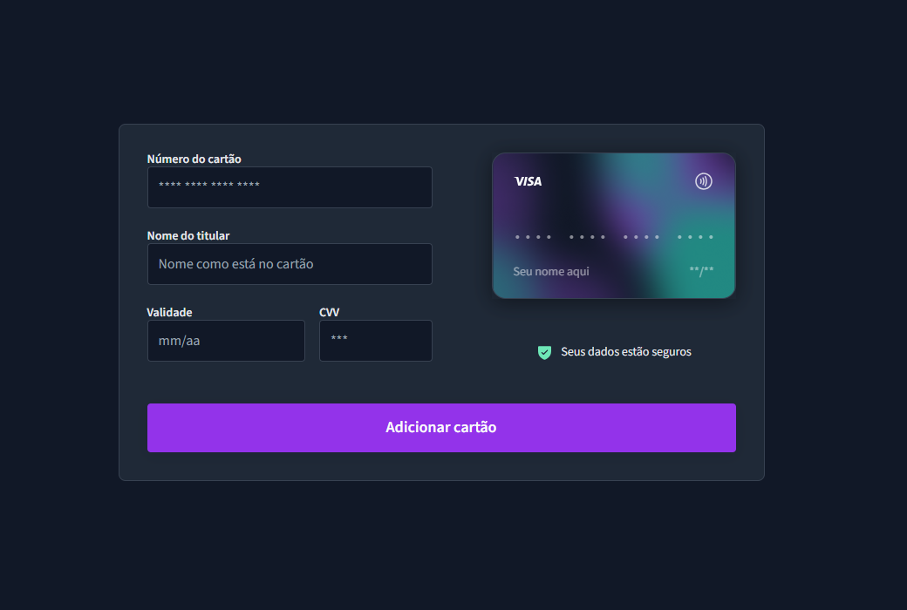</a>
          </td>
        </tr>
        <tr>
          <td>14</td>
          <td>
            <a href="componente-de-upload">Componente de Upload</a>
          </td>
          <td align="center">
           <a href="https://lucazcruz.github.io/bora-codar/componente-de-upload/">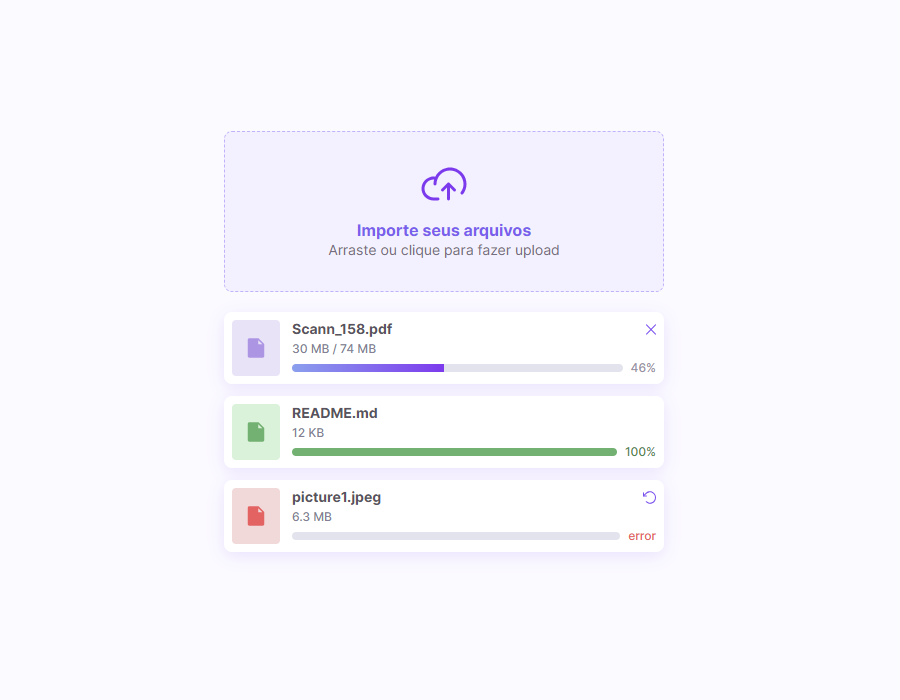</a>
          </td>
        </tr>
        <tr>
          <td>15</td>
          <td>
            <a href="pricing-table">Pricing Table</a>
          </td>
          <td align="center">
           <a href="https://lucazcruz.github.io/bora-codar/pricing-table/">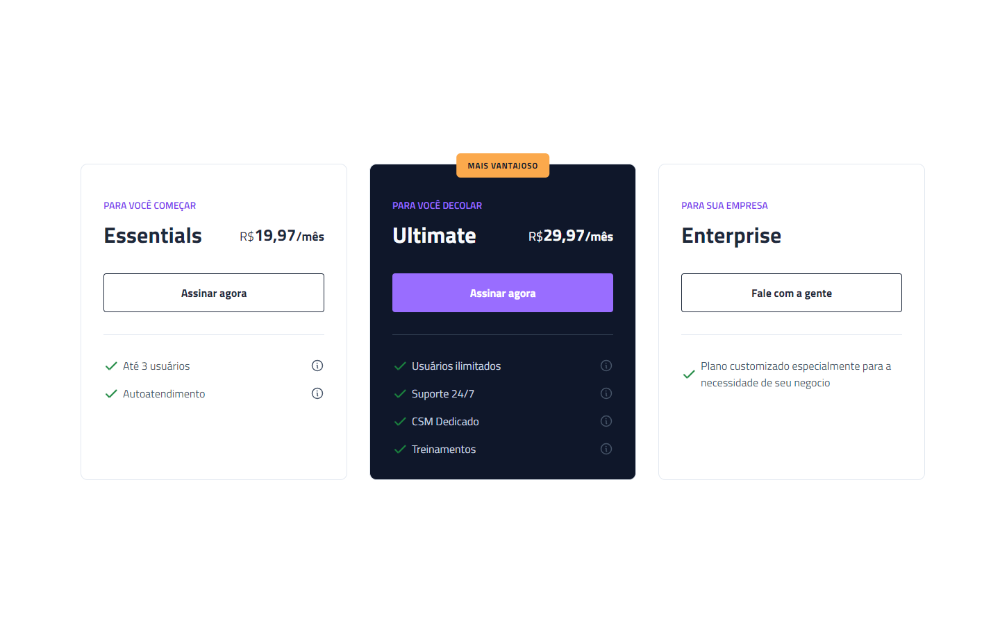</a>
          </td>
        </tr>
        <tr>
          <td>16</td>
          <td>
            <a href="contacts-page">Contacts Page</a>
          </td>
          <td align="center">
           <a href="https://lucazcruz.github.io/bora-codar/contacts-page/">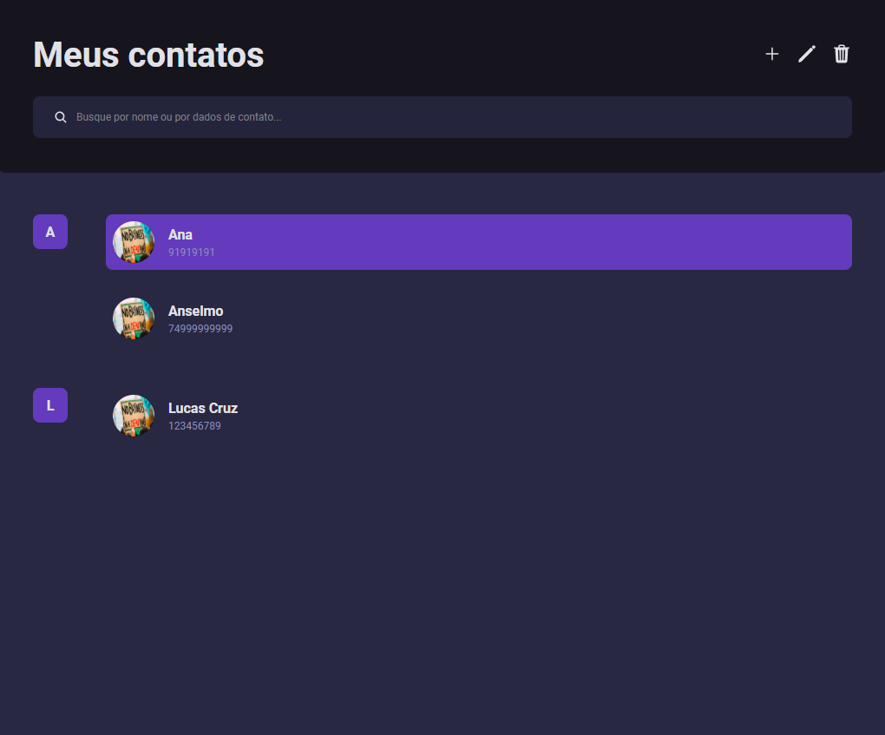</a>
          </td>
        </tr>
        <tr>
          <td>17</td>
          <td>
            <a href="date-picker">Date Picker</a>
          </td>
          <td align="center">
            
          </td>
        </tr>
        <tr>
          <td>18</td>
          <td>
            <a href="card-de-personagem">Card de Personagem</a>
          </td>
          <td align="center">
            <a href="https://lucazcruz.github.io/bora-codar/card-de-personagem/">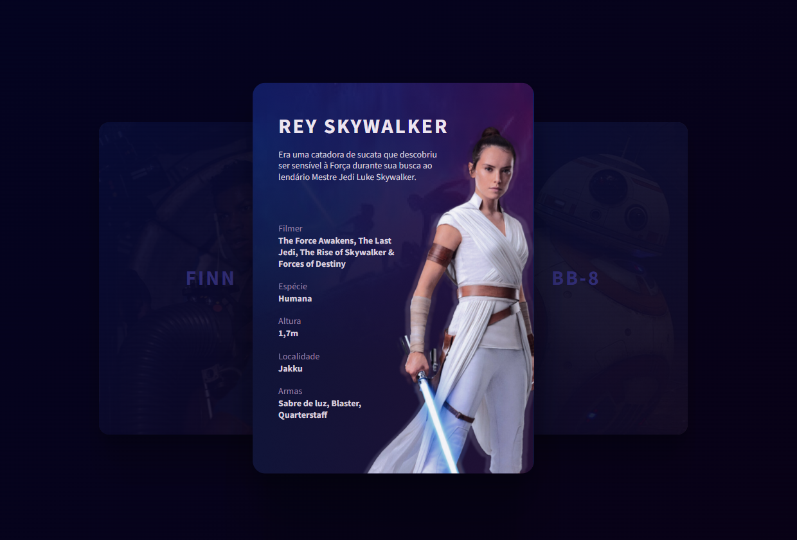</a>
          </td>
        </tr>
        <tr>
          <td>19</td>
          <td>
            <a href="widget-de-transporte">Widget de Transporte</a>
          </td>
          <td align="center">
            <a href="https://lucazcruz.github.io/bora-codar/widget-de-transporte/">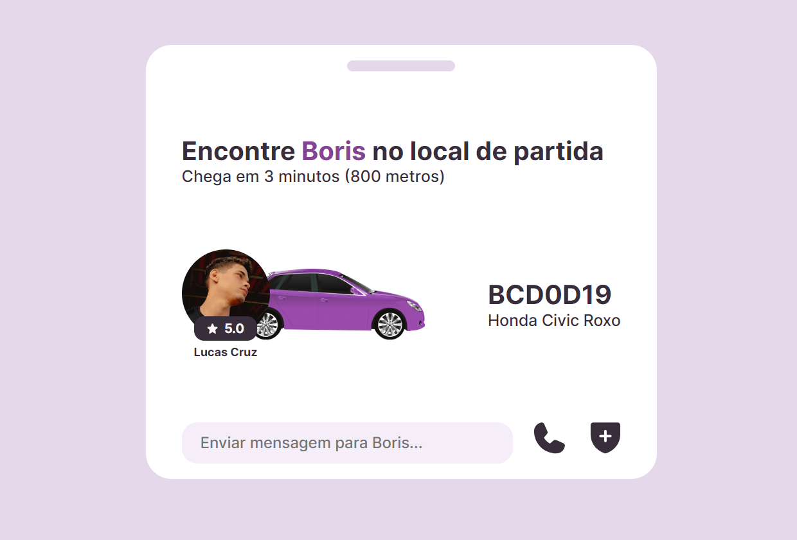</a>
          </td>
        </tr>
        <tr>
          <td>20</td>
          <td>
            <a href="galeria-hover">Galeria Hover</a>
          </td>
          <td align="center">
            <a href="https://lucazcruz.github.io/bora-codar/galeria-hover/">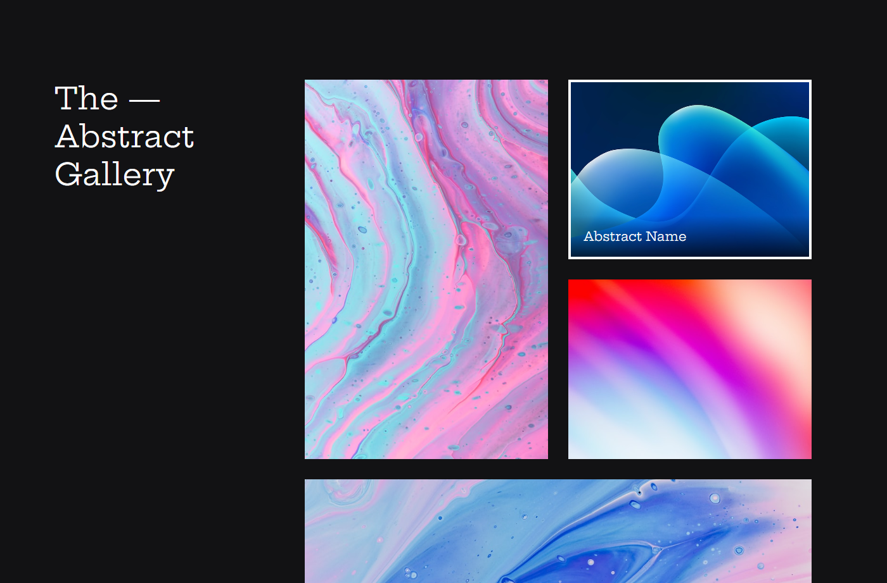</a>
          </td>
        </tr>
        <tr>
          <td>21</td>
          <td>
            <a href="shopping-cart">Shopping Cart</a>
          </td>
          <td align="center">
            <a href="https://lucazcruz.github.io/bora-codar/shopping-cart/">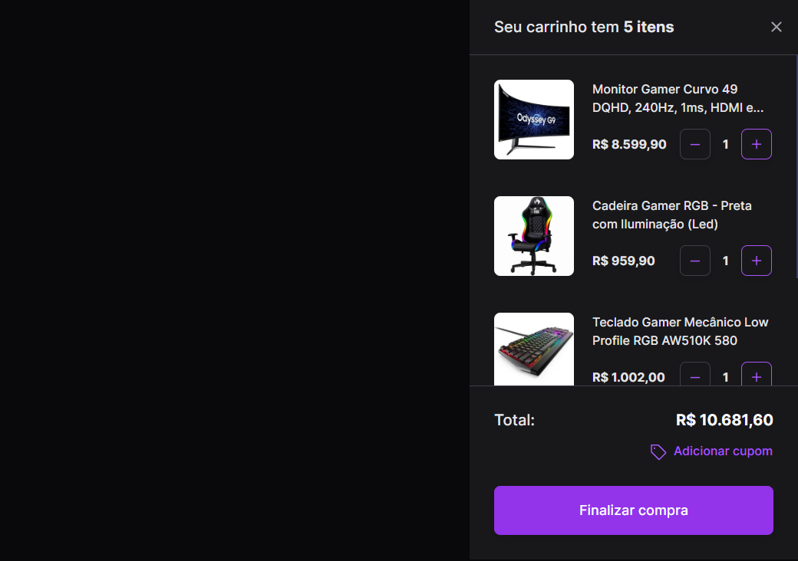</a>
          </td>
        </tr>
        <tr>
          <td>22</td>
          <td>
            <a href="profile-settings">Profile Settings</a>
          </td>
          <td align="center">
            <a href="https://lucazcruz.github.io/bora-codar/profile-settings/">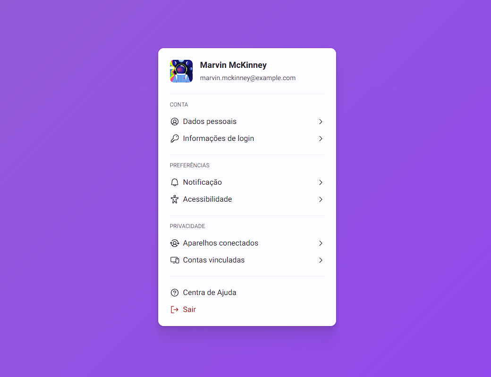</a>
          </td>
        </tr>
        <tr>
          <td>23</td>
          <td>
            <a href="form-multi-step">Formulário Multi Step</a>
          </td>
          <td align="center">
            <a href="https://lucazcruz.github.io/bora-codar/form-multi-step/">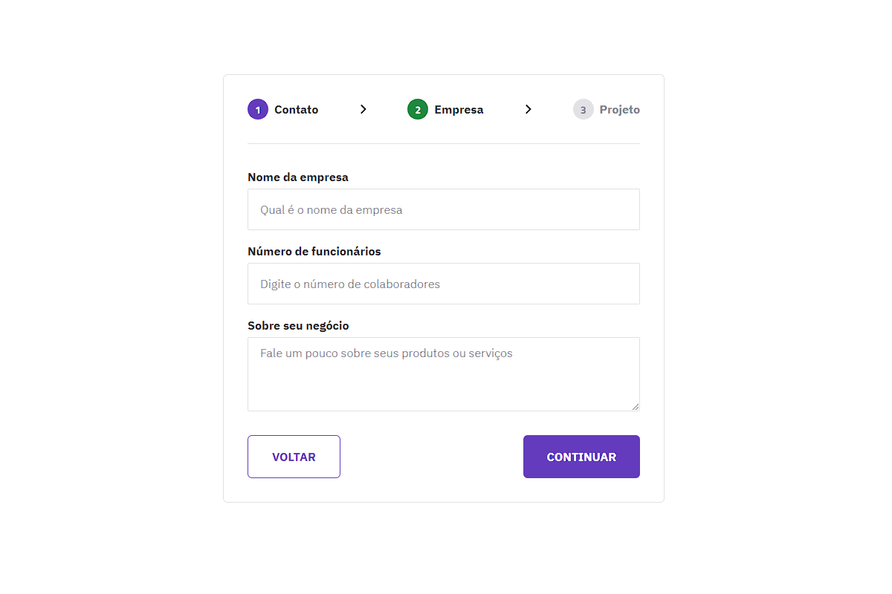</a>
          </td>
        </tr>
        <tr>
          <td>24</td>
          <td>
            <a href="lighting-adjustments">Lighting Adjustments</a>
          </td>
          <td align="center">
            <a href="https://lucazcruz.github.io/bora-codar/lighting-adjustments/">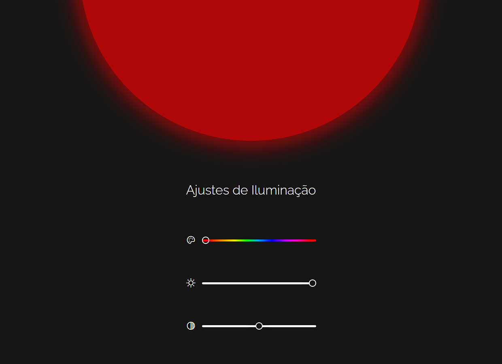</a>
          </td>
        </tr>
        <tr>
          <td>25</td>
          <td>
            <a href="vr-player">Player de VR</a>
          </td>
          <td align="center">
            <a href="https://lucazcruz.github.io/bora-codar/vr-player/">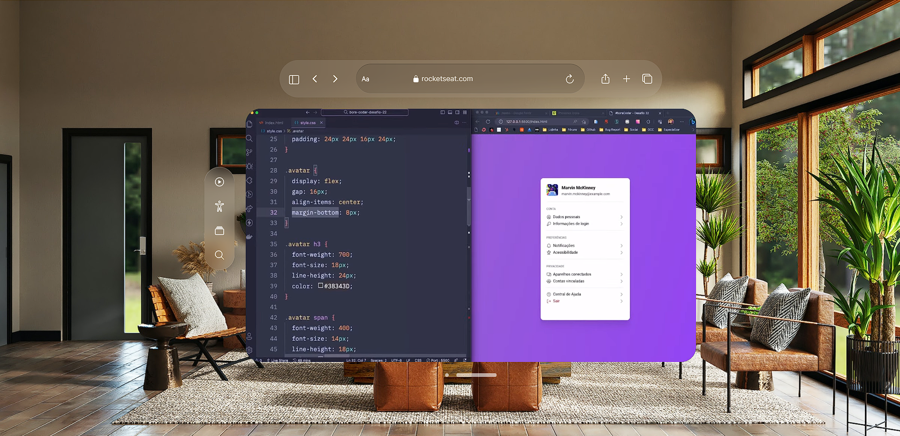</a>
          </td>
        </tr>
        <tr>
          <td>26</td>
          <td>
            <a href="receita-junina">Receita Junina</a>
          </td>
          <td align="center">
            <a href="https://lucazcruz.github.io/bora-codar/receita-junina/">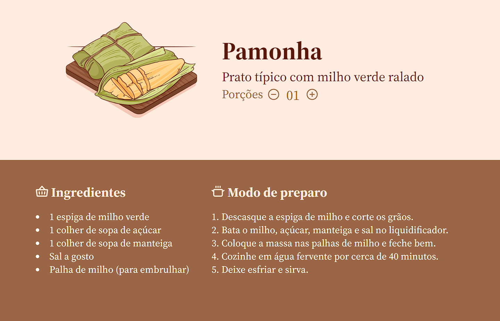</a>
          </td>
        </tr>
        <tr>
          <td>27</td>
          <td>
            <a href="page-404">Page 404</a>
          </td>
          <td align="center">
            <a href="https://lucazcruz.github.io/bora-codar/page-404/">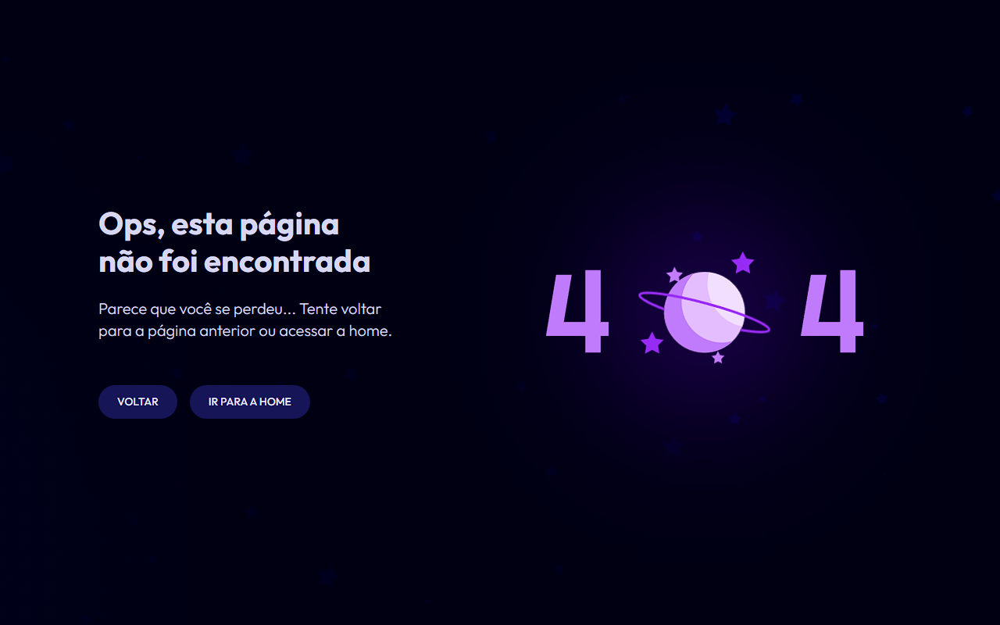</a>
          </td>
        </tr>
        <tr>
          <td>28</td>
          <td>
            <a href="plataforma-de-ia">Plataforma de IA</a>
          </td>
          <td align="center">
            
          </td>
        </tr>
        <tr>
          <td>29</td>
          <td>
            <a href="antes-e-depois">Antes e Depois</a>
          </td>
          <td align="center">
            <a href="https://lucazcruz.github.io/bora-codar/antes-e-depois/">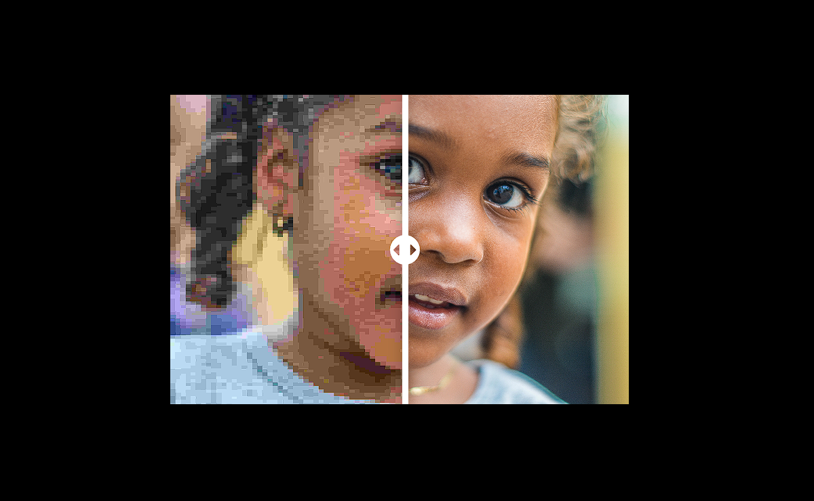</a>
          </td>
        </tr>
        <tr>
          <td>30</td>
          <td>
            <a href="ai-movie-recommendation">Recomendação de Filme com IA</a>
          </td>
          <td align="center">
            <a href="https://lucazcruz.github.io/bora-codar/ai-movie-recommendation/">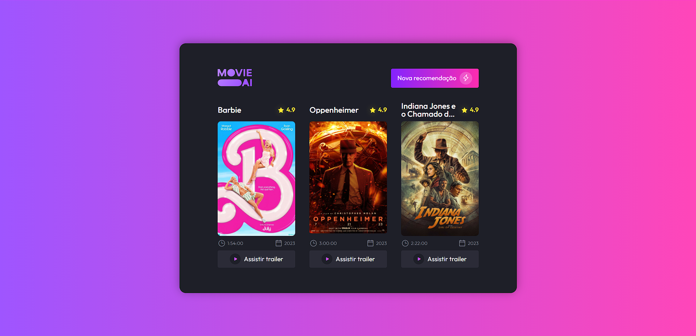</a>
          </td>
        </tr>
        <tr>
          <td>31</td>
          <td>
            <a href="transcription-video">Transcription Video</a>
          </td>
          <td align="center">
            <a href="https://lucazcruz.github.io/bora-codar/transcription-video/">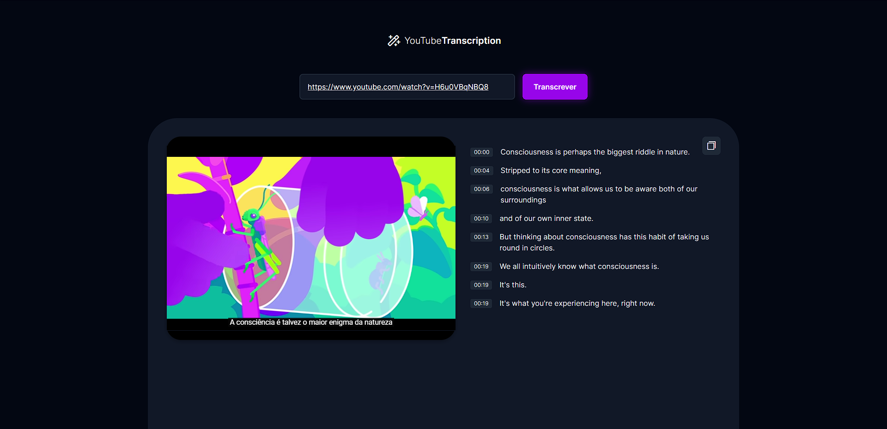</a>
          </td>
        </tr>
        <tr>
          <td>32</td>
          <td>
            <a href="https://github.com/lucazcruz/sql-translation-app/tree/main">Transcription Video</a>
          </td>
          <td align="center">
            <a href="https://github.com/lucazcruz/sql-translation-app/tree/main">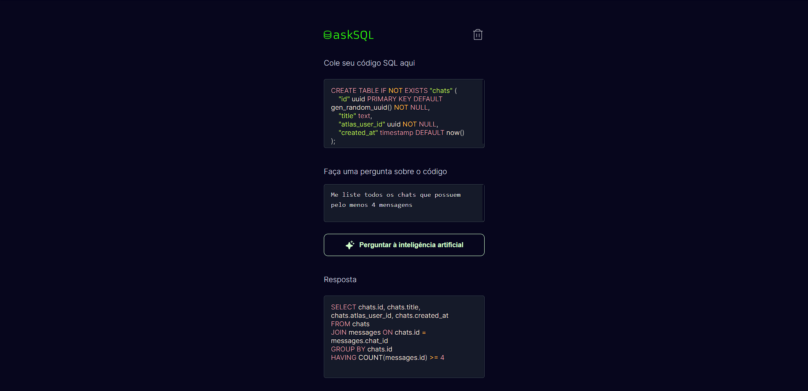</a>
          </td>
        </tr>
        <tr>
          <td>33</td>
          <td>
            <a href="gerador-de-ticket">Gerador de Ticket</a>
          </td>
          <td align="center">
            
          </td>
        </tr>
        <tr>
          <td>34</td>
          <td>
            <a href="shopping-list">Shopping List</a>
          </td>
          <td align="center">
            <a href="https://lucazcruz.github.io/bora-codar/shopping-list/">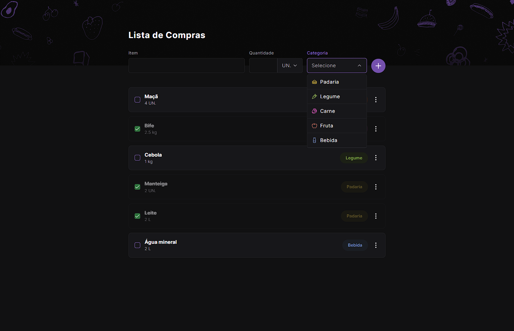</a>
          </td>
        </tr>
        <tr>
          <td>39</td>
          <td>
            <a href="shopping-list">Avaliação de Produtos</a>
          </td>
          <td align="center">
            <a href="https://lucazcruz.github.io/bora-codar/avaliacao-de-produtos/">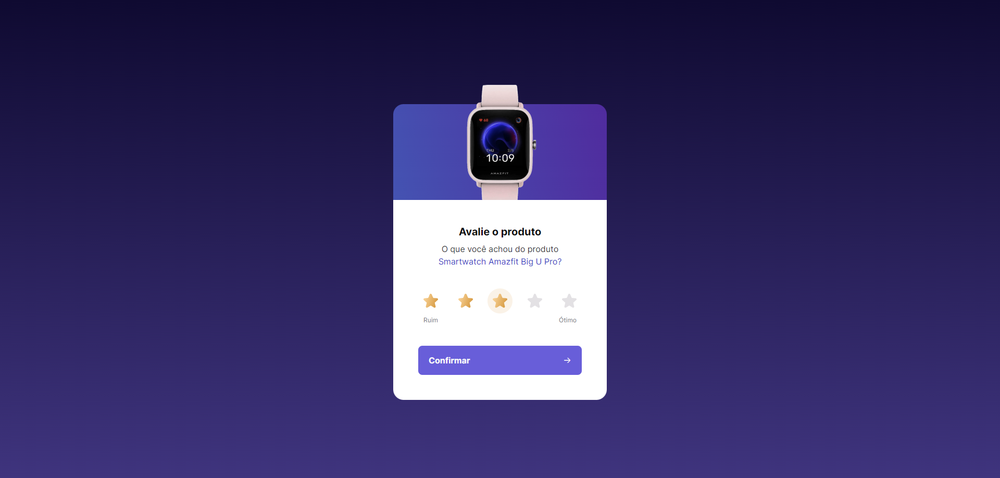</a>
          </td>
        </tr>
        <tr>
          <td>40</td>
          <td>
            <a href="newsletter-page">Newsletter Page</a>
          </td>
          <td align="center">
            <a href="https://lucazcruz.github.io/bora-codar/newsletter-page/">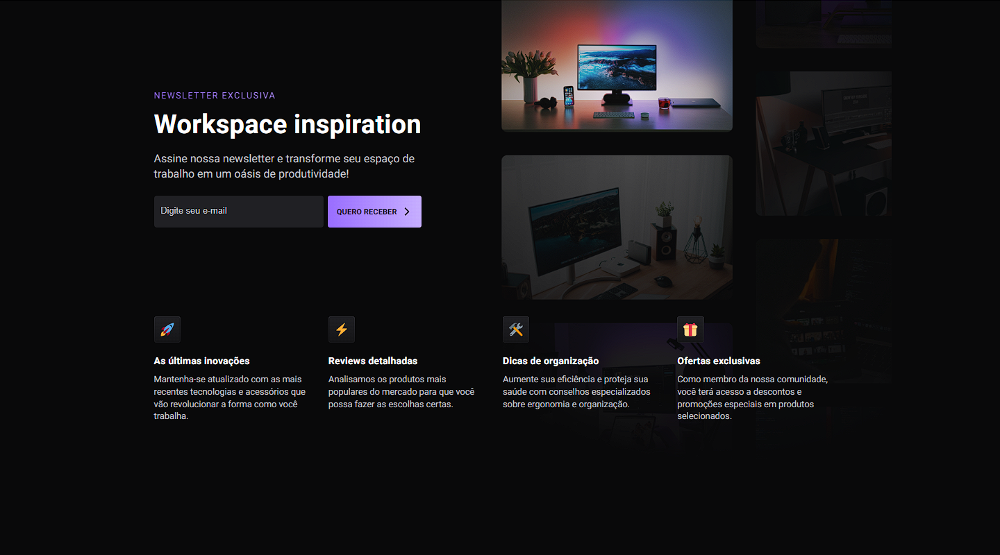</a>
          </td>
        </tr>
    </tbody>
</table>

